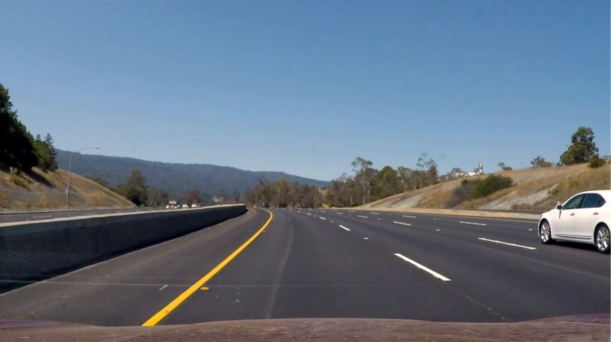
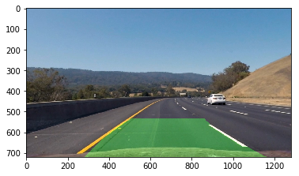

## Advanced Lane Finding

The Project
---

The goal of this project is to detect the lanes in a video, and create an overlay of detected lanes on the original video.

The steps of this project are the following:

* Compute the camera calibration matrix and distortion coefficients given a set of chessboard images.
* Apply a distortion correction to raw images.
* Use color transforms, gradients, etc., to create a thresholded binary image.
* Apply a perspective transform to rectify binary image ("birds-eye view").
* Detect lane pixels and fit to find the lane boundary.
* Determine the curvature of the lane and vehicle position with respect to center.
* Warp the detected lane boundaries back onto the original image.
* Output visual display of the lane boundaries and numerical estimation of lane curvature and vehicle position.

One input image before processing:

and the final result for this image as:

The source and processed videos are not included here. The source video can be downloaded from Udacity git repo for this project.