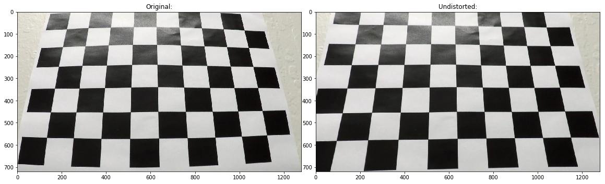
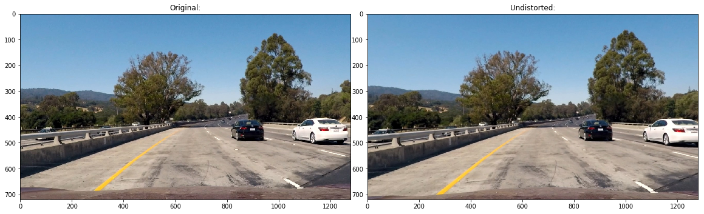
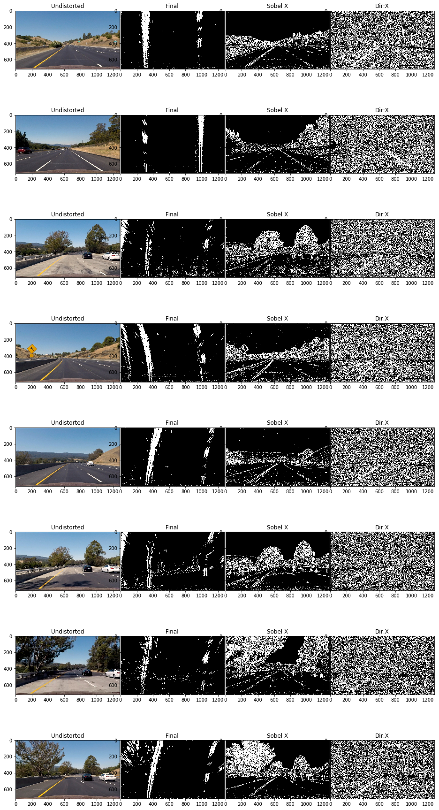
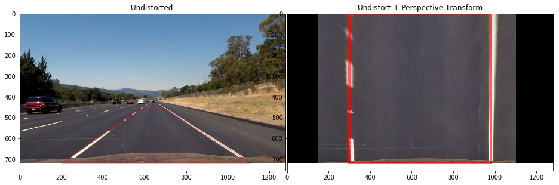
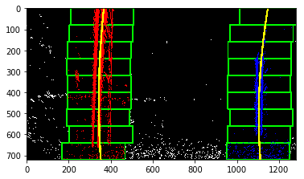

## Advanced Lane Finding 

---

**Advanced Lane Finding Project**

The goals / steps of this project are the following:

* Compute the camera calibration matrix and distortion coefficients given a set of chessboard images.
* Apply a distortion correction to raw images.
* Use color transforms, gradients, etc., to create a thresholded binary image.
* Apply a perspective transform to rectify binary image ("birds-eye view").
* Detect lane pixels and fit to find the lane boundary.
* Determine the curvature of the lane and vehicle position with respect to center.
* Warp the detected lane boundaries back onto the original image.
* Output visual display of the lane boundaries and numerical estimation of lane curvature and vehicle position.

---

### Camera Calibration

#### 1. Get Calibration Matrix.

I used the images of chessboard in camera_cal and openCV for camera calibration. Here I'm assuming the chessboard is fixed on the (x,y) plane at z=0. I first use cv2.findChessboardCorners to find all the corners in the images. And then use cv2.calibrateCamera with all the successfully found corners to calculate camera matrix, the vector of distortion coefficients, and the camera vectors of rotation and translation. Finally I apply cv2.undistort to all raw images to get undistorted images.

Here is an example of undistorted image (origin and after undistorted)

We can see the lines of the 2nd images are more straight than the original image.

The function used in my code for the distortion correction is undistort()

### Pipeline (single images)

#### 1. Get the undistorted images by using the camera calibration matrix from "Camera Calibration". Here is an example of the original raw image from the project video and the one after calibration:

#### 2. Binary Thresholding 

In this stage, we want to mask out the pixels only on the lanes as more as possible. 

I first convert the input image from RGB color space to HSV and HLS color space. Both the HSL Saturate channel and HSV Value channel separate the lane lines very from the background. This makes sense science the lines tend to to have saturated color and with high value. Both of them have similar performance in my experiment, but HSV Value channel is slightly better. I also tried the R channel of RGB. It seems to have similar performance as HSV in my pipeline.

Then I applied Sobel filter in X and Y direction with threshold to extract the pixels on lanes markers. Most of the time those lines are tend to be close to vertical, but if there is a sharp turn, those lines could be more close to horizontal. So I used Sobel filter in both directions. Then, I used direction filter to filter out the pixels with gradient more close to X and Y direction, respectively. The direction filter is used combined with the Sobel filter in X or Y direction to filter out some noises further more. So, there are 2 binary output so far, one is to capture the pixels on vertical orientated lanes, another is to capture the more horizontal orientated lanes. Finally, I combined these 2 binary outputs by a pixel wise "OR" operation. Any pixel appears in any of the result will be in the final output binary images. Here are some output_images of this stage processing:

The first column shows the undistorted color images, the 2nd column shows the final images, the 3rd column shows the result of Sobel filter in X direction, and the final column shows the result of direction filter in vertical. Note the final images are after perspective transformation. 

The function used for the single image process is image_process(img) in my code. 

#### 3. Get bird-view images

I select the 4 source points in one of the input images with straight lane lines. The source points were picked along the lines to make a trapezoid. The destination points are picked to make a rectangle. I turned the source points to make the lane lines to be as parallel as possible in the transformed image. And the transformation can also be used to cut out some non-interested areas.

This transformation is applied to the final binary image of the image_process(). The transformed results are also shown in previous image.

The function used for perspective transform is unwarp(img) in my code.  

#### 4. Locate Lanes

In the bird-view binary images, I use a histogram function with bottom half of the image to locate the possible lanes' location in X axis, called leftx_base and rightx_base. Each of them is the center of a searching window. I count the pixels in the searching window. If the total number of pixels is more than a threshold, I treat this is a valid window. then, recalculate the window center and use it as the center of the next searching window. If it's not a valid window, I'll use the previous center. I also checked the calculated center, to make sure they are in a reasonable range by assuming the lane lines should always appear in some area at left and right. After I have all the pixels that thought to be on the left or right lane, I fit those pixels with a 2nd order polynomial. The final result is like this:

The function for this process is fully_search_lanes()

#### 5. Get Radius of Curvature 

We first need to know the distance in real world represented by a pixel in the image.  Then, the radius of curvature of left and right lane can be calculated with all the detected pixels. 

The function for curvature calculate is cal_calculate()

#### 6. Draw Lanes

Finally, I draw the detected lanes back to the undistorted image as shown in the following image. A inverse perspective transformation matrix is used in this step which is from the perspective transformation step.

---

### Pipeline (video)

I try to locate the lanes in each frame of the video. The fully_search_lanes is called at initial or when lost tracking the lanes, otherwise, a quick search can be applied. The quick search search pixels around the lines detected in previous frames, and update the fit lines at end.

I checked the lines detected by fully search and quick search to see if they are "good" or not. If they are good, I'll update the most recent detect lanes. The lanes displayed in the final image is an average of the lanes detected from multiple frames. The checking for quick search is more strict than the fully search. If quick search failed in checking, I'll trigger a fully search. The checking I used are:

1. the radius of curvature should be reasonable according to road spec.
2. the change of lane curvature shouldn't be dramatical from one frame to its next one.
3. the position of left and right lane should be in a range. like the start point of left lane shouldn't appear at right part of the image, and shouldn't be too far away at left from the center of the image.
4. the width of the lane (distance between left and right lane start points) shouldn't be too large or too small.

Here are my results for the 3 videos of this project:

[project_output.mp4](output_images/project_output.mp4)

[challenge_output.mp4](output_images/challenge_output.mp4)

[harder_challenge_output.mp4](output_images/harder_challenge_output.mp4)

---

### Discussion

My pipeline tends to fail when there is a sharp turn, image is too bright or too dark. This may cause a few pixels are in the binary images so lines can't be detected. Or, the image is too noisy from some objects with high contrast colors or or near the road. This may cause some pixels that are not part of the lines are detected as part of the line. The will cause wrong detection of lines.

To make the pipeline more robust, I think the keys are filter out the pixels correctly in the binary image and find the pixels belonging to the lanes correctly. 

Some ideas are:

1. Threshold on the color, luminance or saturate to remove some unwanted pixels
2. denoise is very important. Try to remove some small scattered dots/patches, even this may lose some pixels on the lines.
3. Use some preset lines as guide lines in searching and choose the best fit guide line according to detection history and the detection of the other line.
4. add more checks for the fit lines. The fit line should be line a line segment or a curve in one direction. 