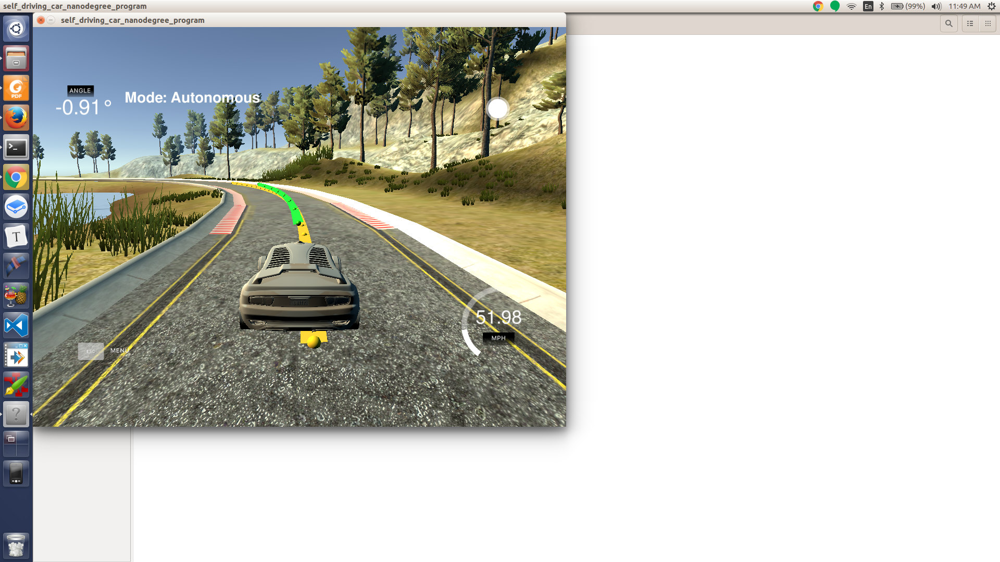
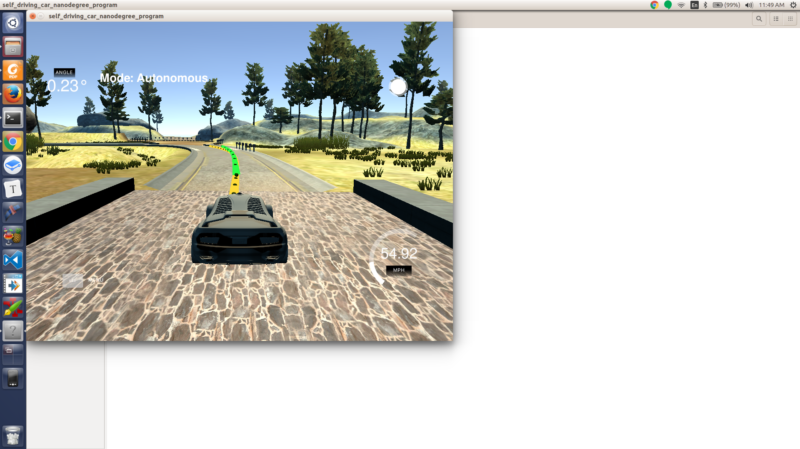

# CarND-Controls-MPC
This is the MPC project from Self-Driving Car Engineer Nanodegree Program.

---

## Basic Build Instructions

1. Clone this repo.
2. Make a build directory: `mkdir build && cd build`
3. Compile: `cmake .. && make`
4. Run it: `./mpc`.

## Screenshots




## The Model

The model is a Kinematic model and neglects the complex interactions between the tires and the road. The model equations are as follow:

```
x[t] = x[t-1] + v[t-1] * cos(psi[t-1]) * dt
y[t] = y[t-1] + v[t-1] * sin(psi[t-1]) * dt
psi[t] = psi[t-1] + v[t-1] / Lf * delta[t-1] * dt
v[t] = v[t-1] + a[t-1] * dt
cte[t] = f(x[t-1]) - y[t-1] + v[t-1] * sin(epsi[t-1]) * dt
epsi[t] = psi[t] - psides[t-1] + v[t-1] * delta[t-1] / Lf * dt
```

Where:
Model states: 
- `x, y` : Car's position.
- `psi` : Car's heading direction.
- `v` : Car's velocity.
- `cte` : Cross-track error.
- `epsi` : Orientation error.


Other Parameters:
'Lf': the distance between the car of mass and the front wheels.

Model output:
- `a` : Car's acceleration (throttle).
- `delta` : Steering angle.

The goal is to find the acceleration (`a`) and the steering angle(`delta`) to minimize the cost function made by following factors :

- Square sum of `cte` and `epsi`. [code](./src/MPC.cpp#L56)
- Square sum of the difference actuators to penalize actuator's actions.[code](./src/MPC.cpp#L63).
- Square sum of the difference between two consecutive actuator values to penalize sharp changes. [code](./src/MPC.cpp#L70).

## Factors Tuning

### Timestep Length and Elapsed Duration (N & dt)

Prediction horizon is defined by the number of points, or timestep length(`N`) and the time interval, or elapsed duration(`dt`). The number of points impacts the controller performance as well.
First to tried to keep the horizon around the same time the waypoints were on the simulator. However, the controller will start to run slower and even unstable if there are too many points. 
`N` was tried from 10 to 20 and `dt` was tried from 100 to 500 milliseconds. Finally 10 and 100 milliseconds were used for `N` and `dt`, respectively. 

### Polynomial Fitting and MPC Preprocessing

The waypoints provided by the simulator are transformed to the car coordinate system at [./src/main.cpp L104 to L113](./src/main.cpp#L104). Then a 3rd-degree polynomial is fitted to the transformed waypoints. These polynomial coefficients are used to calculate the `cte` and `epsi` later on. They are used by the solver as well to create a reference trajectory.
This simplifies the process to fit a polynomial to the waypoints because the vehicle's x and y coordinates are now at the origin (0, 0) and the orientation angle is also zero.

### Model Predictive Control with Latency

To handle actuator latency, the state values are calculated using the the delay interval, instead of using the intial one. [./src/main.cpp L121 to L139](./src/main.cpp#L121) .

## Simulation

### The vehicle must successfully drive a lap around the track.

The vehicle successfully drives on the track at top speed around 55mph. A short video with the final parameters: [./videos/final.mov](./videos/final.mov).

