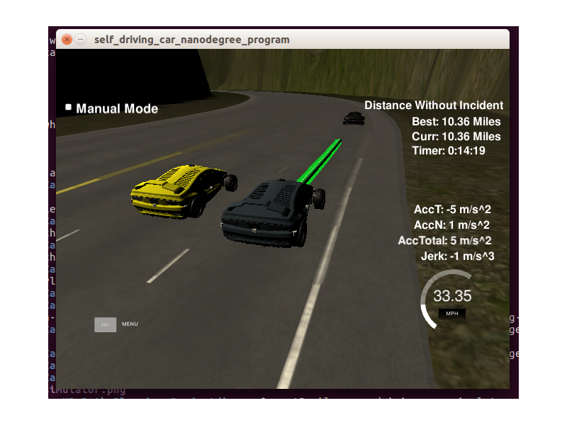
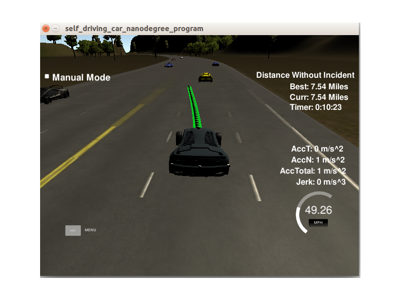
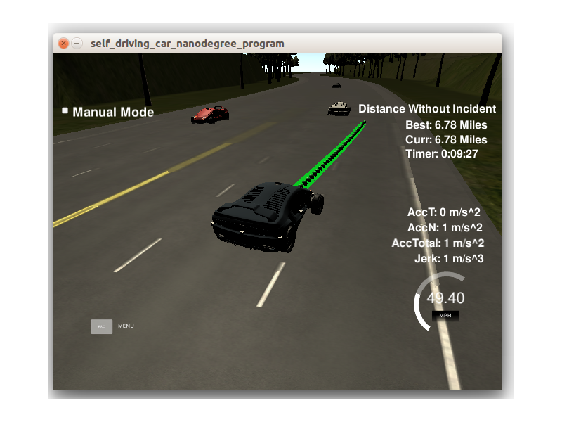
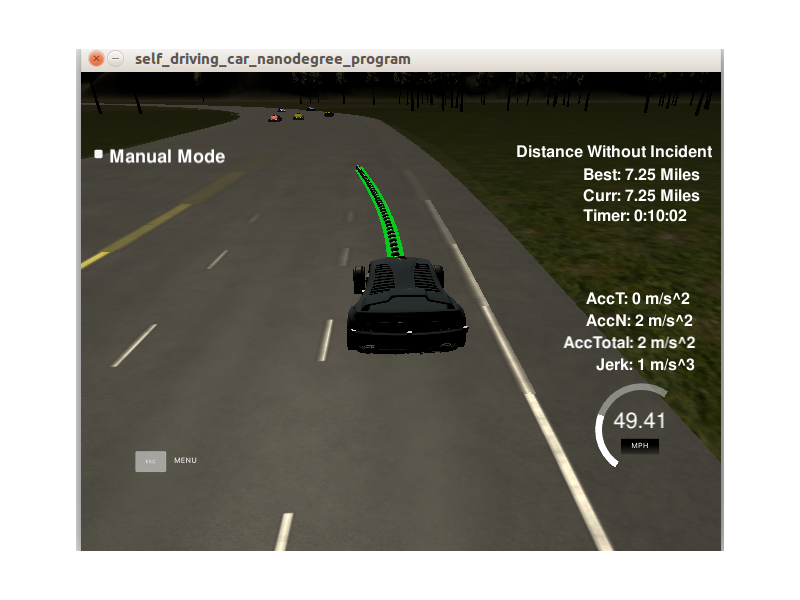

# CarND-Path-Planning-Project
Self-Driving Car Engineer Nanodegree Program
   
# Overview

## Goal: safely navigate the car on a virtual highway with other traffic that is driving +-10 MPH of the 50 MPH speed limit in the simulator.

* The car should try to go as close as possible to the 50 MPH speed limit.
* Bypass slower traffic if possible.
* Avoid collisions with other cars at all cost. 
* Driving in the marked lanes at all times, unless when changing lanes.
* Finish one whole loop.
* The car should not experience total acceleration over 10 m/s^2 and jerk that is greater than 10 m/s^3.

### Input: 

* Car's localization and sensor fusion data. 
* A sparse map list of waypoints around the highway.

For detailed description of the input data, please visit [Udacity's Project](https://github.com/udacity/CarND-Path-Planning-Project)

## Basic Build Instructions

1. Clone this repo.
2. Make a build directory: `mkdir build && cd build`
3. Compile: `cmake .. && make`
4. Run it: `./path_planning`.

# Prerequisites

The project has the following dependencies (from Udacity's seed project):

- cmake >= 3.5
- make >= 4.1
- gcc/g++ >= 5.4
- libuv 1.12.0
- Udacity's simulator.

# Rubic

* Car passed 10 miles without incidents.  

* Car is able to behavior correctly under those cases:

* No speed limit red message was seen.
* Max acceleration and jerk are not exceeded.
* No collisions.
* The car stays in its lane most of the time, and changes lane when necessary. 

## Reflection

I put all my code in main function, between the comments "Student Code Start" and "Student Code End". It would be better to create separate classes in different files.

### Prediction [line 257 to line 297](./src/main.cpp#L257)

Predict other cars speeds and positions with the given telemetry and sensor fusion data. In this project, I only detect following situations from the environment:
- There is at least one car in front of us.
- There is at least one car to the right of us.
- There is at lesst one car to the left of us.

These are detected by calculating the lane each other car is and the position it will be at at the end of the last plan trajectory. If the car is within 30m in front or behind us, it's taken as "dangerous".

### Behavior [line 300 to line 329](./src/main.cpp#L300)
Based on the situations detected in prediction stage, this part of code will make decision of:
- If a car blocks us ahead: try to change left lane, if can't, try to change to right lane, if still not, slow down.
- Change back to center lane whenever feasible.
- Speed up to 49.5 MPH if safe.
`speed_change` is used to accumulate the speed changing decisions.

### Trajectory [line 364 to line 435](./src/main.cpp#L364)
This code generates the trajectory based on the speed and lane output from the behavior, car coordinates and past path points.

A spline is created with previous trajectory points. Then, those coordinates are   are transformed (shift and rotation) to local car coordinates. The rest of past trajectory points are also copied to the new trajectory to get a more continuity result. The speed is also adjusted based on every trajectory points here.
