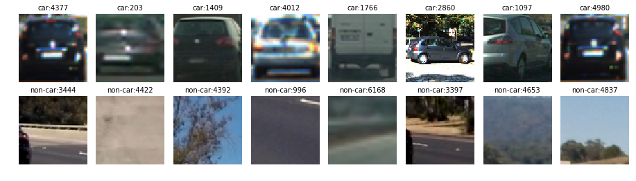
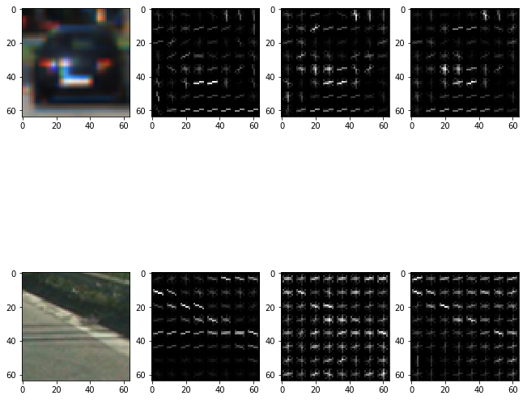
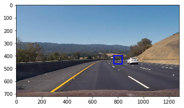
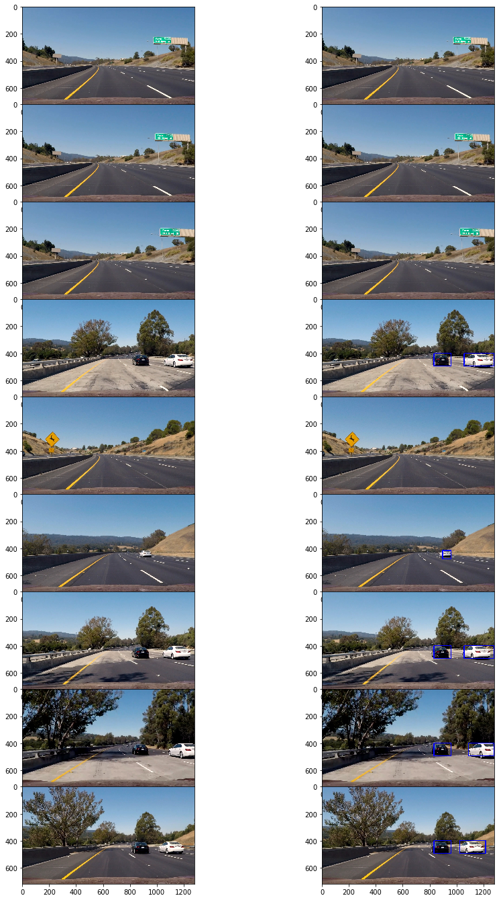
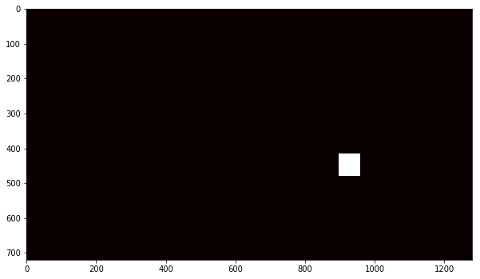

#Writeup Report

**Vehicle Detection Project**

The goals / steps of this project are the following:

* Perform a Histogram of Oriented Gradients (HOG) feature extraction on a labeled training set of images and train a classifier Linear SVM classifier
* Explore other techniques: color transform and binned color features, histograms of color, and append these features  to HOG feature vector. 
* Implement a sliding-window technique and use the trained classifier to search for vehicles in images.
* Run the pipeline on a video stream 
* and create a heat map of recurring detections frame by frame to reject outliers and follow detected vehicles.
* Estimate a bounding box for vehicles detected.

## Source code and Files
* utilities.py: some utility functions such as drawing the bound box, extracting features, color space converting, etc.
* Vehicle_Detection.ipynb: the python notebook for this project, including model training, feature tuning, and image/video processing.
* test_images: some images for test the image process. I also added some images from the project video that has false detections.
* output_images: some images dump in the experiments. 

###Histogram of Oriented Gradients (HOG)

####1. Explain how (and identify where in your code) you extracted HOG features from the training images.

The code for this step is get_hog_features() in utilities.py. 

I started by reading in all the `vehicle` and `non-vehicle` images.  Here is an example of one of each of the `vehicle` and `non-vehicle` classes:

I then explored different color spaces and different `skimage.hog()` parameters (`orientations`, `pixels_per_cell`, and `cells_per_block`).  I grabbed random images from each of the two classes and displayed them to get a feel for what the `skimage.hog()` output looks like.

Here is an example using the `YCrCb` color space and HOG parameters of `orientations=11`, `pixels_per_cell=(8, 8)` and `cells_per_block=(2, 2)`:

Here we can see the HOG in all the 3 channels are very different for Car and NotCar images. It's not so sensitive to the color, size, position of the car (and not-car) in the image.

####Explain how you settled on your final choice of HOG parameters.

I tried various combinations of parameters. For example:

| Num  | Orientation | Pixels per Cell | Cell Per Block |
| ---- | ----------- | --------------- | -------------- |
| 1    | 8           | 8               | 8              |
| 2    | 11          | 16              | 2              |
| 3    | 11          | 4               | 8              |

The 2nd one has the best test and validate accuracy when I trained the SVM model. To me, if the cell is too small, the HOG feature became less distinguishable between car and not car images.

####3. Describe how (and identify where in your code) you trained a classifier using your selected HOG features 

The code is in the "Train the model" section in the python notebook. 

I trained a linear SVM using sklearn. First I normalize all the features by using sklearn StandardScaler. I then generated the labels for the car and not-car images, and split the dataset to test and validation set with ratio of 80% vs 20%. 

I also used color histogram as features, and appended them to HOG features to make a feature vector. The final validation(test) accuracy is 99.3%. I also tried color spacial, but I think the training accuracy is good enough.

###Sliding Window Search

####1. Describe how (and identify where in your code) you implemented a sliding window search.  How did you decide what scales to search and how much to overlap windows?

The code for this part is in the section of "Searching Window" in the notebook. 

I first use window size of 64x64 and search the center part of the image  (from 400 to 528 in Y dimension). Here is the result:

Instead of detecting the car, it detect a part of the road as a car. 

Then I scaled the searching window by 1.5x, it detected the car successfully. 

####2. Show some examples of test images to demonstrate how your pipeline is working.  What did you do to optimize the performance of your classifier?

Ultimately I searched on four scales using YCrCb 3-channel HOG features plus histograms of color in the feature vector, and I did double searching in the center of the image with original scale but with a 16 pixel shift. This could make the detection in this region more accurate.

  Here are some example images:

---

### Video Implementation

####1. The processed video
Here's a [link to my video result](./project_video_out.mp4)

####2. Describe how (and identify where in your code) you implemented some kind of filter for false positives and some method for combining overlapping bounding boxes.

This part of code is in "Process The Video" section in the notebook. I created a class name CarDetect to tracing the detection across  the frames. I stored the rectangles that detected a car into a list (CarDetect.rect_frames), then create a heatmap from these rectangles. I only keep 6 frame in this project. Then, I use the half of the number of rectangles as a throttle to filter out some false detections, but this throttle won't exceed 5. Then, I used scipy.ndimage.measurements label to identify individual blobs and assumed each blob corresponded to a car. Finally I create a bound box of the blobs.

Here is an example image of labeled box after heatmap 

---

###Discussion

####1. Briefly discuss any problems / issues you faced in your implementation of this project.  Where will your pipeline likely fail?  What could you do to make it more robust?

My pipeline has some false detections especially in shadows along side of the road. Since the validation accuracy is pretty high, I think we may need more data or better model. Deep learning should be a very good solution to this. I know there are some very popular networks like SSD, Fast-RCNN etc. I may want to study these models later.

I workaround this by average the positive detections across frames. The false detection usually only exist in 1 to 3 frames, but averaging them out I cam remove most of the false detections. A better but more computation expensive way might be to track the detected cars (the bonding boxes of labels). The cars won't jump around (except the monster truck) so we probably use this as a filter.

Another issue is my detection is not precise for the detected cars. The bounding box may include larger or smaller areas around the car, not exactly surrounding the car tightly. Probably I can use more scales/positions of searching window, but fundamental issue may be the model is not good enough and the averaging positive detected rectangles sometimes made it worse.

