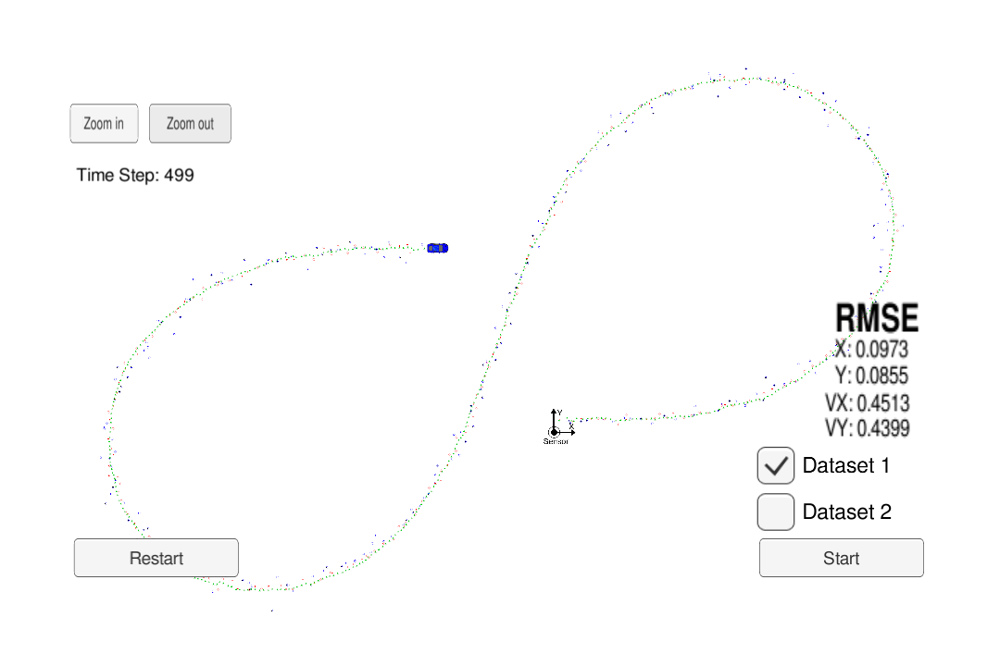

# Extended Kalman Filter Project 

Code for Udacity CarND Extended Kalman Filter Project.

# Result

Using the Lidar and Radar measurements to track the moving car.

# Build 

mkdir build && cd build

cmake .. && make

./ExtendedKF

# Code

## FusionEKF

The kalman_filter is initialized here. And the sensor measurements is processed here by calling kalman_filter based on their types. 

### Initialization

Velocity for both Lidar and Radar measurements are initialized as 0s. Lidar doesn't have velocity measurement. Radar doesn't have enough information in velocity measurements for initialization. Initializing as 0 means we are not certain on the velocity at beginning. 

The Radar measurements are first converted from Polar coordinates to Cartesian Coordinates to initialize states.

### Measurement processing

If it's from Lidar, use kalman filter to process it. If it's from Radar, use extended kalman filter to process it.

