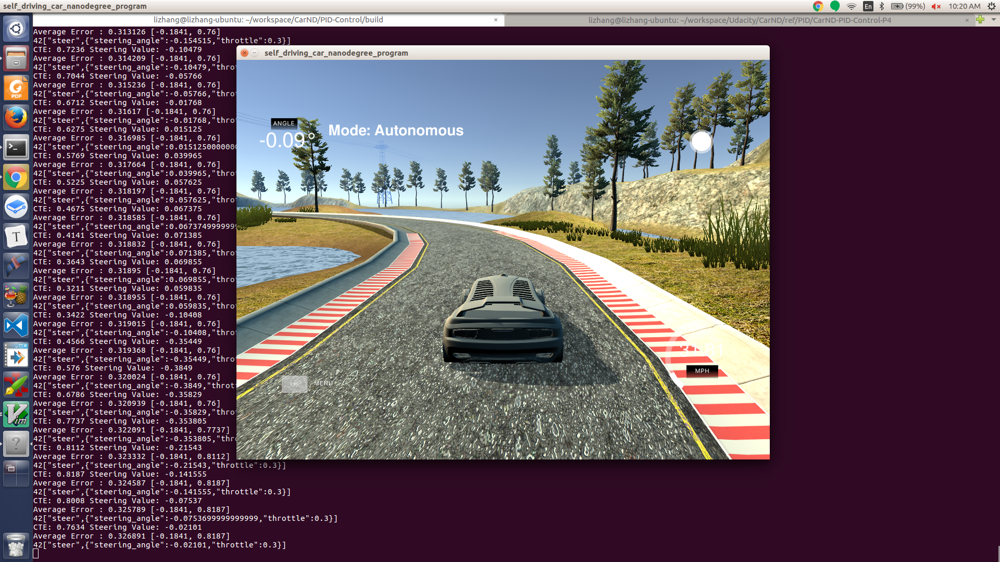
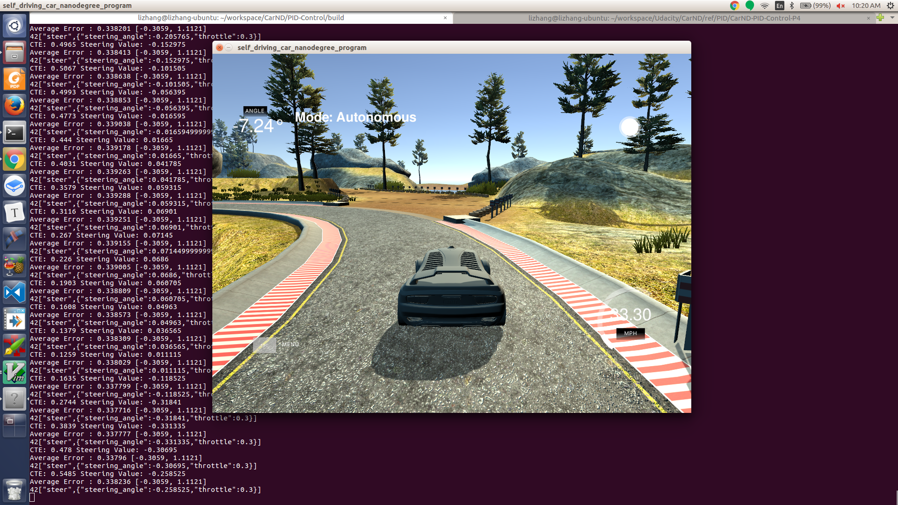

# PID-Control
Udacity Self-Driving Car Nanodegree - PID Control project

# Overview

This project implements a [PID controller](https://en.wikipedia.org/wiki/PID_controller) to control a car in Udacity's simulator. The simulator sends cross-track error, speed and angle to the PID controller(PID) and it receives the steering angle ([-1, 1] normalized) and the throttle to drive the car. 

# Prerequisites

The project has the following dependencies:

- cmake >= 3.5
- make >= 4.1
- gcc/g++ >= 5.4
- Udacity's simulator.

# Compiling and executing the project
1. Run build.sh. It will create a build directory and generate execution binary named "pid". 
2. Run "pid" along with the simulator, choose PID project in the simulator. 

# Screen shots
Here are some screen shots from the simulator running with the PID controller. 

