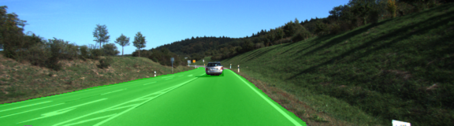

# Semantic Segmentation
### Introduction
In this project, you'll label the pixels of a road in images using a Fully Convolutional Network (FCN).

The network uses the architecture described in [Long et al.](https://people.eecs.berkeley.edu/~jonlong/long_shelhamer_fcn.pdf)
and is trained on the [Kitti Road dataset](http://www.cvlibs.net/datasets/kitti/eval_road.php).

### Some Results
Here are some test results after trained 50 epoches. It looked like it may still get better results if to train more epoches, but the improvments will be very minor. So I stopped at 50.



### Setup
##### Frameworks and Packages
Make sure you have the following is installed:
 - [Python 3](https://www.python.org/)
 - [TensorFlow](https://www.tensorflow.org/)
 - [NumPy](http://www.numpy.org/)
 - [SciPy](https://www.scipy.org/)
##### Dataset
Download the [Kitti Road dataset](http://www.cvlibs.net/datasets/kitti/eval_road.php) from [here](http://www.cvlibs.net/download.php?file=data_road.zip).  Extract the dataset in the `data` folder.  This will create the folder `data_road` with all the training a test images.

### Start
##### Implement
Implement the code in the `main.py` module indicated by the "TODO" comments.
The comments indicated with "OPTIONAL" tag are not required to complete.
##### Run
Run the following command to run the project:
```
python main.py
```