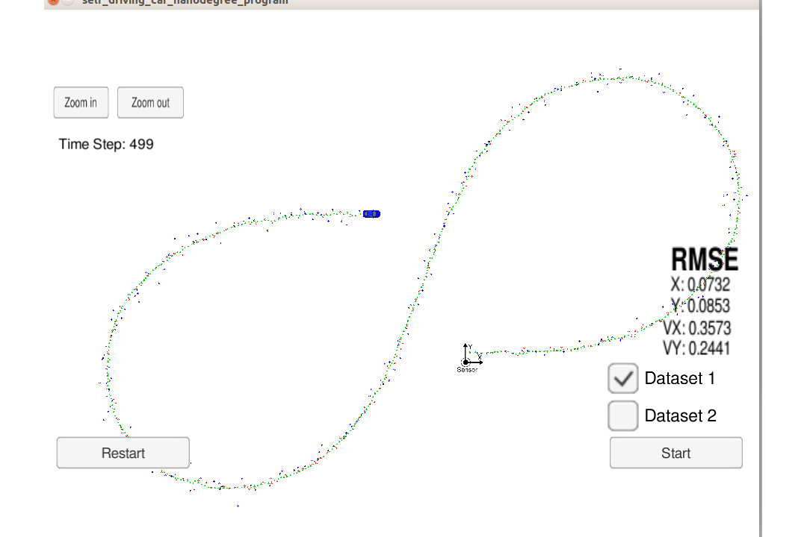

# Unscented Kalman Filter Project 
This code is for the UKF project of Self-Driving Car Engineer Nanodegree Program from Udacity.

In this project utilize an Unscented Kalman Filter to estimate the state of a moving object of interest with noisy lidar and radar measurements. 

## Build and Run

1. mkdir build
2. cd build
3. cmake ..
4. make
5. ./UnscentedKF

Results:

---

